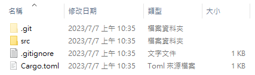
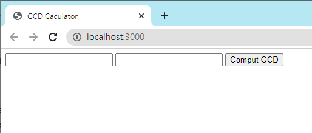
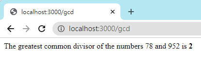

Rust 基礎環境建構與導覽程式
===
>1. 環境安裝
>    1. 使用rustup安裝rust
>    2. 有新版本發布時可使用以下指令更新
>        ```rust=
>        $ rustup update
>        ```
>    3. 安裝完成後可以在命令提示字元(以下簡稱CMD)使用3項新指令
>        ```rust
>        $ cargo --version #Rust編譯管理器、程式包管理器、以及其他工具
>        $ rustc --version #Rust編譯器，通常由cargo來呼叫
>        $ rustdoc --version #Rust文件工具，同rustc使用方式
>        ```
>2. 建立專案  
>    在CMD輸入以下指令
>    ```rust=
>    $ cargo new hello
>    ```
>    這個指令會建立一個基礎專案，資料夾**hello**內會含以下檔案  
>    
>   
>    在資料夾**src**裡面有一個**main.rs**是我們的主程式碼
>    ```rust
>    fn main() {
>    println!("Hello, world!");
>    }
>    ```
>    在**hello**資料夾內任一個目錄執行以下CMD指令即可組建並執行程式
>    ```rust=
>    $ cargo run
>    
>    D:\hello>cargo run
>    Compiling hello v0.1.0 (D:\hello)
>     Finished dev [unoptimized + debuginfo] target(s) in 0.39s
>      Running `target\debug\hello.exe`
>    Hello, world!
>    ```
>    執行完畢後，rustc會產生可執行檔，放置於target/debug目錄下，若要清除生成檔案，可使用以下指令
>    ```rust=
>    $ cargo clean
>    ```
>3. 常用敘述介紹  
>    #### ***參考***  
>    Rust有一種參考語法，類似C語言的指標，&和*，假設今天程式碼為:
>    ```rust
>    for m in &n[1..] {
>        d = 2 + *m;
>    }
>    ```  
>    前面的<b>&n[1..]</b>是指m借用n第二個以後的元素為參考，for迴圈會依序參考每一個元素，*m則解參考，也就是值。  
>    #### ***fn***  
>    Rust的函式表達法，在名稱後的括號裡面為傳入的參數，後面<b>-></b>是回傳值的型態，Rust也有**return**陳述句，若函式本體是一個運算式，且結尾沒有分號，則運算式即為回傳值，除非你想要在函式中間提早返回，才需要使用**return**陳述句，以下是**fn**範例:
>    ```rust
>    fn gcd(mut n: u64, mut m: u64) -> u64 {
>        assert!(n != 0 && m != 0);
>        while m != 0 {
>            if m < n {
>                let t = m;
>                m = n;
>                n = t;
>            }
>            m = m % n;
>        }
>        n
>    }
>    ```
>    `變數型態例如u64、i32、f32在後面才會講解`  
>    #### ***mut***  
>    mutable，可變，意指可讓函式本體對其進行賦值  
>    #### ***assert!***  
>    字元表示他為巨集呼叫式，並非函式呼叫式，在Rust裡assert!會確認引數為**True**，若為**False**則會中止程式並提供訊息，此種情況稱為**panic**，Rust另有<b>debug_assert!</b>巨集，可跳過斷言情形  
>    #### ***while***  
>    與C語言不同的地方在於，條件運算式不用括號，同***if***  
>    #### ***let***  
>    宣告區域變數，若Rust可以從變數用法推斷變數型態，則不用寫出他的型態，故你也可以這樣寫  
>    ```rust
>    let t: u64 = m;
>    ```  
>    #### ***use***  
>    在Rust我們將標準函式庫稱做**trait**，類似python的package，我們需要將程式庫加入才可以使用裡面的函式進行開發  
>    #### ***checked***  
>    整數算數於Num traits裡面有`checked`進行運算檢查，若數學上正確結果可用該型態表示則回傳Some(value)否則為None，比如:
>    ```rust
>    assert_eq!(10_u8.checked_add(20), Some(30));
>    assert_eq!(100_u8.checked_add(200), None);
>    assert_eq!((-128_i8).checked_div(-1), None);
>    ```  
>    第三行程式碼由於i8代表數字-2<sup>7</sup>\~2<sup>7</sup>-1(-128\~127)，所以當-128除以-1正常來說是128但是無法以i8型態表示故回傳`None`
>    #### ***wrapping***  
>    整數算數於Num traits裡面有`wrapping`進行溢位表示檢查，回傳數學上正確結果並且值會在該型態表示範圍內，比如:  
>    ```rust
>    assert_eq!(100_u16.wrapping_mul(200), 20000);
>    assert_eq!(500_u16.wrapping_mul(500), 53392);
>    assert_eq!(127_i8.wrapping_add(1), None);
>    assert_eq!(5_i16.wrapping_shl(17), 10);
>    ```  
>    1. 在第二行500*500正常來說是250000但是由於u16表示型態限制，故0\~65535，65536\~131071，131072\~196607，196608\~250000前三段皆為u16表示上限，此wrapping_mul僅會表達最後一段也就是`250000-196608=53392`的數字部分  
>    2. 同理第四行程式是逐位元移位運算，5在16位元中是`0101`(省略前面0的位元)，移動17位元則會造成溢位，故在wrapping_shl裡會直接簡化成移動1位元變成1010(也就是10)，若更改移位為14位元則溢位部份直接忽略，結果為0100(省略後面0的位元)  
>    #### ***saturating***  
>    整數算數於Num traits裡面有`saturating`，回傳最接近正確數學結果可表示的值，除法、餘數、逐位元移位運算沒有saturating方法:
>    ```rust
>    assert_eq!(32760_i16.saturating_add(10), 32767);
>    assert_eq!((-32760_i16).saturating_sub(10), -32768);
>    ```
>    #### ***overflowing***  
>    整數算數於Num traits裡面有`overflowing`，回傳一個tuple:`(result, overflowed)`，其中**result**是**wrapping**回傳東西，**overflowed**是一個布林代表是否發生溢位:
>    ```rust
>    assert_eq!(255_u8.overflowing_sub(2), (253, flase));
>    assert_eq!(255_u8.overflowing_add(2), (1, true));
>    ```
>    補充說明一下，**overflowing_shl**和**overflowing_shr**的模式與上面的sub、add稍微不同，shl是左移位元，shr是右移位元，當移動距離大於等於位元寬才會回傳**True**
>    #### ***Vec***  
>    可擴展向量型態，等於C++的**std::vector**、python的**list**、Javascript的**array**  
>    #### ***expect***  
>    這個方法會檢查解析成功與否，若是錯誤則會印出訊息，成功則會產生值，例如:  
>    ```rust
>    fn get_user(username: &str) -> Option<&str> {
>        if username.is_empty() {
>            return None;
>        }
>    
>        return Some(username);
>    }
>    
>    fn main() {
>        let result = get_user("123").expect("fetch user");
>    
>        println!("user = {:?}", result);
>    }
>    ```  
>    你會得到  
>    ```rust
>    $ D:\hello> cargo run
>     Compiling hello v0.1.0 (D:\hello)
>      Finished dev [unoptimized + debuginfo] target(s) in 0.21s
>       Running `target\debug\hello.exe`
>    user = "123"
>    ```  
>    若將main函式裡面的get_user("123")改成get_user("")，則會得到
>    ```rust
>    $ D:\hello> cargo run
>     Compiling hello v0.1.0 (D:\hello)
>      Finished dev [unoptimized + debuginfo] target(s) in 0.31s
>       Running `target\debug\hello.exe`
>    thread 'main' panicked at 'fetch user', src\main.rs:12:31
>    note: run with `RUST_BACKTRACE=1` environment variable to display a backtrace
>    error: process didn't exit successfully: `target\debug\hello.exe` (exit code: 101)
>    ```  
>5. 單元測試  
>    Rust內建簡單的測試功能，在*src/main.rs*程式碼結尾新增以下程式測試gcd函式:  
>    ```rust
>    #[test]
>    fn test_gcd() {
>        assert_eq!(gcd(14, 15), 1);
>        assert_eq!(gcd(2 * 3 * 5 * 11 * 17, 3 * 7 * 11 * 13 * 19), 3 * 11);
>    }
>    ```
>    一開始的<b>#[test]</b>代表**test_gcd**是一個測試函式，在一般編譯時會跳過，直到使用**cargo test**執行時會自動呼叫它，以下為實際範例:  
>    ```rust
>    $ D:\Rust-learn\hello>cargo test
>    Compiling hello v0.1.0 (D:\Rust-learn\hello)
>     Finished test [unoptimized + debuginfo] target(s) in 0.84s
>      Running unittests src\main.rs (target\debug\deps\hello-ef9163e0687327fa.exe)
>    
>    running 1 test
>    test test_gcd ... ok
>    
>    test result: ok. 1 passed; 0 failed; 0 ignored; 0 measured; 0 filtered out; finished in 0.00s
>    ```  
>6. 處理命令列引數  
>    為了將命令列的引數輸入到程式內，我們先修改**main**函式:
>    ```rust
>    use std::str::FromStr;
>    use std::env;
>
>    fn main() {
>        let mut numbers = Vec::new();
>
>        for arg in env::args().skip(1) {
>            numbers.push(u64::from_str(&arg).expect("error parsing argument"));
>        }
>
>        if numbers.len() == 0 {
>            eprintln!("Usage: gcd NUMBER ...");
>            std::process::exit(1);
>        }
>
>        let mut d = numbers[0];
>        for m in &numbers[1..] {
>            d = gcd(d, *m);
>        }
>
>        println!("The greatest common divisor of {:?} is {}", numbers, d);
>    }
>    ```  
>    ```rust
>    $ D:\Rust-learn\hello> cargo run 42 56
>     Compiling hello v0.1.0 (D:\Rust-learn\hello)
>      Finished dev [unoptimized + debuginfo] target(s) in 0.30s
>       Running `target\debug\hello.exe 42 56`
>    The greatest common divisor of [42, 56] is 14
>    ```  
>7. 簡易網頁以及內嵌語法  
>    1. 首先建立新的專案  
>        ```rust
>        $ D:\Rust-learn> cargo new actix-gcd
>             Created binary (application) `actix-gcd` package
>        ```  
>    2. 編輯**Cargo.toml**檔案，引用我們需要的程式包，在<b>[dependencies]</b>裡面每一行程式碼都代表引用的crate名稱以及相關版本資訊。
>        ```rust
>        [package]
>        name = "actix-gcd"
>        version = "0.1.0"
>        edition = "2021"
>
>        # See more keys and their definitions at https://doc.rust-lang.org/cargo/reference/manifest.html
>    
>        [dependencies]
>        actix-web = "1.0.8"
>        serde = {version = "1.0", features = ["derive"]}
>        ```  
>    3. 編輯<b>actix-gcd/src/main.rs</b>:
>        ```rust
>        use actix_web::{web, App, HttpResponse, HttpServer};
>    
>        fn main() {
>            let server = HttpServer::new(|| {
>                App::new()
>                    .route("/", web::get().to(get_index))
>            });
>            println!("Serving on http://localhost:3000...");
>            server.bind("127.0.0.1:3000").expect("error binding server to address").run().expect("error running server");
>        }
>    
>        fn get_index() -> HttpResponse {
>            HttpResponse::Ok().content_type("text/html").body(r#"
>                                                                <title>GCD Caculator</title>
>                                                                <form action="/gcd" method="post">
>                                                                <input type="text" name="n"/>
>                                                                <input type="text" name="m"/>
>                                                                <button type="submit">Comput GCD</button>
>                                                                </form>
>                                                                "#,
>                                                            )
>        }
>        ```  
>    4. 解釋:  
>    **main**函式呼叫<b>actix_web::HttpResponse</b>建立一個伺服器，針對<b>"/"</b>回應請求然後印出一個訊息告知我們如何連接網站，並讓他監聽port3000。
>    我們傳給<b>HttpServer::new</b>的引數是Rust closure運算式<b> || { App::new() ... }</b>，當啟動server時，也會啟動一個執行緒來處理傳入的資料，每一個執行緒都會呼叫closure取得一個新App值。然後我們在程式碼<b>web::get().to(get_index)</b>呼叫get_index函式來回應HTTP的get請求。  
>    5. 嵌入語法  
>    Rust使用<b>r</b>加上0個以上的<b>#</b>加上雙引號<b>"</b>來表示串裡的字元皆不會被轉譯。  
>    6. 執行  
>        ```rust
>        $ D:\Rust-learn\actix-gcd> cargo run
>            Updating crates.io index
>          Downloaded serde_derive v1.0.171
>          Downloaded proc-macro2 v1.0.64
>          Downloaded serde v1.0.171
>          Downloaded regex v1.9.1
>          Downloaded syn v2.0.25
>          Downloaded regex-automata v0.3.2
>          Downloaded 6 crates (1.3 MB) in 1.70s
>           Compiling autocfg v1.1.0
>           Compiling winapi v0.3.9 
>           Compiling cfg-if v0.1.10
>        ...
>           Compiling actix-web v1.0.9
>           Compiling actix-gcd v0.1.0 (D:\Rust-learn\actix-gcd)
>            Finished dev [unoptimized + debuginfo] target(s) in 33.09s
>             Running `target\debug\actix-gcd.exe`
>        Serving on http://localhost:3000...
>        ```  
>    前往<b>http://localhost:3000</b>之後會呈現:  
>    
>   
>    7. 建立新路由處理網頁表單<b>POST</b>請求，首先在<b>actix-gcd/src/main.rs</b>加入新的<b>use</b>指令:  
>        ```rust
>        use serde::Deserialize;
>        ```  
>    8. 定義一個Rust結構型態承接我們從表單收到的值:  
>        ```rust
>        #[derive(Deserialize)]
>        struct GcdParameters {
>            n: u64,
>            m: u64,
>        }
>        ```  
>    我們在裡面定義了2個欄位，型態都是<b>u64</b>，也就是我們最大公因數函式gcd所需要的引數型態。struct上面的註解是一個屬性，類似<b>#[test]</b>。這個屬性即要求<b>serde</b> crate在編譯程式的時候檢查型態並自動產生程式碼，從HTML表單在POST請求中使用的格式的資料解析出這類型態的值。  
>   
>    9. 在<b>actix-gcd/src/main.rs</b>新增函式:  
>        ```rust
>        fn post_gcd(form: web::Form<GcdParameters>) -> HttpResponse {
>            if form.n == 0 || form.m == 0 {
>                return HttpResponse::BadRequest().content_type("test/html").body("Computing the GCD with zero is boring.");
>            }
>    
>            let response = format!("The greatest common divisor of the numbers {} and {} is <b>{}</b>\n", form.n, form.m, gcd(form.n, form.m));
>    
>            HttpResponse::Ok().content_type("text/html").body(response)
>        }
>        ```  
>    10. 解釋:  
>    若將函式當成<b>Actix</b>請求的處理函式使用，則引數型態必須是<b>Actix</b>知道如何從<b>HTTP</b>請求中提取的型態。  
>    <b>post_gcd</b>函式中的引數<b>form</b>它的型態是<b>web::Form<GcdParameters></b>，<b>Actix</b>知道如何從<b>HTTP</b>提取任何<b>web::Form<T></b>型態的值，這些型態和函式關係在編譯期就可以確定，若<b>Actix</b>不知道如何處理引數型態，Rust會告知你錯誤。  
>    若參數為0則回傳一個<b>HttpResponse 400 Bad Request</b>，因為<b>gcd</b>函式會<b>panic</b>，若正確輸入，則使用<b>format!</b>巨集建立回應，最後由<b>HttpResponse 200 Ok</b>將回應打包回傳。  
>    11. 修改<b>actix-gcd/src/main.rs</b>將<b>post_gcd</b>成為表單的處理函式:  
>        ```rust
>        fn main() {
>            let server = HttpServer::new(|| {
>                App::new()
>                    .route("/", web::get().to(get_index))
>                    .route("/gcd", web::post().to(post_gcd))
>            });
>            println!("Serving on http://localhost:3000...");
>            server.bind("127.0.0.1:3000").expect("error binding server to address").run().expect("error running server");
>        }
>        ```  
>    加入了一個<b>route</b>，建立<b>web::post().to(post_gcd)</b>作為<b>/gcd</b>路徑的處理函式。記得最後要加入之前寫過的<b>gcd</b>函式才能正常運作喔。  
>   
>    12. 執行  
>        ```rust
>        $ D:\Rust-learn\actix-gcd> cargo run
>         Finished dev [unoptimized + debuginfo] target(s) in 1.83s
>          Running `target\debug\actix-gcd.exe`
>        Serving on http://localhost:3000...
>        ```  
>      
>   
flutter_rust_bridge!簡易程式使用flutter和rust
===
>1. 環境安裝
>    1. 需要安裝[Android studio](https://redirector.gvt1.com/edgedl/android/studio/install/2022.2.1.20/android-studio-2022.2.1.20-windows.exe "android-studio-2022.2.1.20-windows.exe")、[Java](https://www.oracle.com/java/technologies/downloads/#java8-windows "jdk-8u381-windows-x64.exe")、[Flutter](https://docs.flutter.dev/get-started/install "Flutter")   
>    2. 檢查Java版本  
>        ```rust
>        $ C:\Users\User>java -version
>        java version "17.0.8" 2023-07-18 LTS
>        Java(TM) SE Runtime Environment (build 17.0.8+9-LTS-211)
>        Java HotSpot(TM) 64-Bit Server VM (build 17.0.8+9-LTS-211, mixed mode, sharing)
>        ```  
>    3. 若沒有辦法查詢Java版本請至環境變數中設定系統變數，在<b>`Path`</b>新增以下路徑(視使用者而定)  
>        ```rust
>        Path C:\Program Files\Java\jdk-1.8\bin
>        ```
>    4. 確認Android studio SDK的NDK設定  
>       - Android Studio > Tools > SDK Manager > Android SDK > SDK Tools
>       - [x]  NDK (side by side)
>       - [x]  CMake
>    5. 將NDK路徑儲存等下會用到
>        ```rust
>        Path C:\Users\User\%APPDATA%\Local\Android\Sdk
>        ```
>    6. 下載[LLVM](https://github.com/llvm/llvm-project/releases/download/llvmorg-16.0.6/LLVM-16.0.6-win64.exe "LLVM-16.0.6-win64.exe")，並安裝，並設定系統變數如同上述Java  
>        ```rust
>        Path C:\Program Files\LLVM\bin
>        ```  
>    7. 檢查Flutter安裝，如同Java和LLVM，必須設定系統變數
>        ```rust
>        Path D:\flutter\bin
>        ```  
>        設定完畢後，可於命令提示字元輸入以下指令來檢查安裝的狀態報告  
>        ```rust
>        $ C:\Users\User>Flutter doctor
>        Doctor summary (to see all details, run flutter doctor -v):
>        [√] Flutter (Channel stable, 3.10.5, on Microsoft Windows [版本 10.0.22621.1992], locale zh-TW)
>        [√] Windows Version (Installed version of Windows is version 10 or higher)
>        [√] Android toolchain - develop for Android devices (Android SDK version 34.0.0)
>        [√] Chrome - develop for the web
>        [√] Visual Studio - develop for Windows (Visual Studio Community 2022 17.6.5)
>        [√] Android Studio (version 2022.2)
>        [√] VS Code (version 1.80.1)
>        [√] Connected device (3 available)
>        [√] Network resources
>    
>        • No issues found!
>        ```  
>    8. 安裝其他需要的套件:
>        ```rust
>        $ cargo install flutter_rust_bridge_codegen
>        ```  
>        ```rust
>        $ flutter pub add --dev ffigen && flutter pub add ffi
>        ```  
>        ```rust
>        $ cargo install cargo-xcode # if building for iOS or MacOS
>        ```  
>        ```rust
>        $ cargo install cargo-ndk
>        ```  
>    9. 安裝Rust二進制標準庫，為了適用其他平台，Rust可以安裝這些工具進行交叉編譯([Rust Cross-compilation](https://rust-lang.github.io/rustup/cross-compilation.html "cookbook"))，在各個平台可運行自如!
>        ```rust
>        $ rustup target add armv7-linux-androideabi   # for arm
>        $ rustup target add i686-linux-android        # for x86
>        $ rustup target add aarch64-linux-android     # for arm64
>        $ rustup target add x86_64-linux-android      # for x86_64
>        $ rustup target add x86_64-unknown-linux-gnu  # for linux-x86-64
>        $ rustup target add x86_64-apple-darwin       # for darwin x86_64 (if you have an Intel MacOS)
>        $ rustup target add aarch64-apple-darwin      # for darwin arm64 (if you have a M1 MacOS)
>        $ rustup target add x86_64-pc-windows-gnu     # for win32-x86-64-gnu
>        $ rustup target add x86_64-pc-windows-msvc    # for win32-x86-64-msvc
>        ```  
>2. 建立專案&設定修改&輸出應用程序  
>    1. 將範例專案複製到想要的路徑
>        ```rust
>        $ D:\>git clone https://github.com/fzyzcjy/flutter_rust_bridge && cd flutter_rust_bridge/frb_example/with_flutter/rust
>        Cloning into 'flutter_rust_bridge'...
>        remote: Enumerating objects: 41466, done.
>        remote: Counting objects: 100% (3303/3303), done.
>        remote: Compressing objects: 100% (971/971), done.
>        remote: Total 41466 (delta 2489), reused 3014 (delta 2301), pack-reused 38163
>        Receiving objects: 100% (41466/41466), 24.92 MiB | 13.34 MiB/s, done.
>        Resolving deltas: 100% (30388/30388), done.
>        ```  
>    2. 修改*ANDROID_NDK Gradle property*相關設定:
>       - 檔案路徑`D:\flutter_rust_bridge\frb_example\with_flutter\android`
>       - 檔案名稱`gradle.properties`
>       - 修改敘述(Java版本適應語法):
>       ```rust
>       org.gradle.jvmargs=-Xmx1536M --add-exports=java.base/sun.nio.ch=ALL-UNNAMED --add-opens=java.base/java.lang=ALL-UNNAMED --add-opens=java.base/java.lang.reflect=ALL-UNNAMED --add-opens=java.base/java.io=ALL-UNNAMED --add-exports=jdk.unsupported/sun.misc=ALL-UNNAMED
>       ```  
>       - 新增敘述(使NDK可被Gradle看到):
>       ```rust
>       ANDROID_NDK=(C:\Users\User\AppData\Local\Android\Sdk)
>       ```  
>    3. <b>最重要的一步!</b>這個指令將會在`D:\flutter_rust_bridge\frb_example\with_flutter\android\app\src\main\jniLibs`裡面建立Android適用裝置的<b>`libflutter_rust_bridge_example.so`</b>檔案:  
>       ```rust
>       $ cargo ndk -t armeabi-v7a -t arm64-v8a -t x86_64 -t x86 -o ../android/app/src/main/jniLibs build
>       ```  
>       若無檔案則將會引發以下錯誤:
>       ```rust
>       E/flutter (28996): [ERROR:flutter/runtime/dart_vm_initializer.cc(41)] Unhandled Exception: Invalid argument(s): Failed to load dynamic library 'libflutter_rust_bridge_example.so': dlopen failed: library "libflutter_rust_bridge_example.so" not found
>       ```  
>       在後面使用**Flutter**輸出apk或是windows應用程序都不會看到這個錯誤，除非使用**Android studio**的Console才會看到!!!該項錯誤會導致無法在apk程序中正確使用Rust!我甚至去[flutter_rust_bridge bug feedback](https://github.com/fzyzcjy/flutter_rust_bridge/issues/1289 "困惑了好幾天QQ")回報問題  
>    4. 執行flutter獲取依賴項目:
>       ```rust
>       $ D:\flutter_rust_bridge\frb_example\with_flutter\rust>flutter pub get
>       Resolving dependencies in .....
>         _fe_analyzer_shared 61.0.0 (62.0.0 available)
>         analyzer 5.13.0 (6.0.0 available)
>         collection 1.17.1 (1.17.2 available)
>         ffigen 8.0.2 (9.0.0 available)
>         file 6.1.4 (7.0.0 available)
>         flutter_lints 1.0.4 (2.0.2 available)
>         lints 1.0.1 (2.1.1 available)
>         matcher 0.12.15 (0.12.16 available)
>         material_color_utilities 0.2.0 (0.8.0 available)
>         source_span 1.9.1 (1.10.0 available)
>         stack_trace 1.11.0 (1.11.1 available)
>         stream_channel 2.1.1 (2.1.2 available)
>         test_api 0.5.1 (0.6.1 available)
>         vm_service 11.3.0 (11.8.0 available)
>       Got dependencies in ..!
>       ```  
>    5. windows上執行flutter，裡面會詢問你要在哪個平台做輸出  
>       ```rust
>       $ D:\flutter_rust_bridge\frb_example\with_flutter\rust>flutter run
>       Changing current working directory to: D:\flutter_rust_bridge\frb_example\with_flutter
>       Connected devices:
>       Windows (desktop) • windows • windows-x64    • Microsoft Windows [版本 10.0.22621.1992]
>       Chrome (web)      • chrome  • web-javascript • Google Chrome 114.0.5735.199
>       Edge (web)        • edge    • web-javascript • Microsoft Edge 114.0.1823.82
>       [1]: Windows (windows)
>       [2]: Chrome (chrome)
>       [3]: Edge (edge)
>       Please choose one (or "q" to quit): 1
>       Launching lib\main.dart on Windows in debug mode...
>       windows/runner/Runner.rc does not define use Flutter version information, updating.
>       Building Windows application...                                    42.0s
>       √  Built build\windows\runner\Debug\with_flutter.exe.
>       Syncing files to device Windows...                                  83ms
>       
>       Flutter run key commands.
>       r Hot reload.
>       R Hot restart.
>       h List all available interactive commands.
>       d Detach (terminate "flutter run" but leave application running).
>       c Clear the screen
>       q Quit (terminate the application on the device).
>       
>       A Dart VM Service on Windows is available at: http://127.0.0.1:60790/rj8QKaqy_Pg=/
>       The Flutter DevTools debugger and profiler on Windows is available at:
>       http://127.0.0.1:9100?uri=http://127.0.0.1:60790/rj8QKaqy_Pg=/
>       ```  
>    7. 輸出Android APK，路徑會顯示在最末行，傳輸到手機即可安裝  
>       ```rust
>       $ D:\flutter_rust_bridge\frb_example\with_flutter>flutter build apk
>       
>       Font asset "MaterialIcons-Regular.otf" was tree-shaken, reducing it from 1645184 to 1284 bytes (99.9% reduction). Tree-shaking can be disabled by providing the --no-tree-shake-icons flag when building your app.
>       Running Gradle task 'assembleRelease'...                           33.1s
>       √  Built build\app\outputs\flutter-apk\app-release.apk (20.8MB).
>       ```  
Reference
===
1.[MD手冊](https://hackmd.io/@eMP9zQQ0Qt6I8Uqp2Vqy6w/SyiOheL5N/%2FBVqowKshRH246Q7UDyodFA?type=book "link to tutorial")  
2.[rustup](https://rustup.rs "安裝rustup環境")  
3.[flutter_rust_bridge](https://cjycode.com/flutter_rust_bridge/index.html)  
